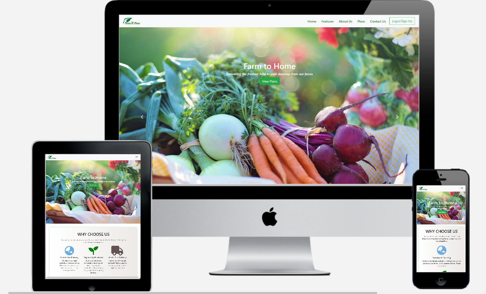

# [Farm To Home](https://may201.github.io/Farm-To-Home-/)

 

  This is a website for an imaginary service that provides fresh grocery supply directly from  organic farms to customer doorstep via an online delivery channel.The website aims to target potential customers to use the Farm to Home service over mass produced super market supply that are often sourced from farms using unsustainable farming techniques and with high pesticide content in their produce. 

 This milestone 1 project has been completed based on basics of HTML and CSS  learnt during the course at Code Institute.

## UX

The business owner wishes to encourage customer to shop their service .By providing information on the product , information on quality and other benefits, the owner is enbaling the customer to have a better shopping experience with added benefit of an online delivery service.

### User Stories

* As a  user of this website I am looking for oragnically produced groceries.
* As a user I am environmentally conscious of my purchasing decisons and food preferences.
* As a user I am looking for online delivey channels for ease of shopping.

### Wireframes

Wireframe  have been produced via Balsamiq to accomadate mobile and desktop designs.

#### [Wireframe for Desktop ](assets/img/desktop.png)

#### [Wireframe for Mobile ](assets/img/mobile.png)

## Features 

All the features were added to enhance the UX and make using the website easy to use.
A green theme has been mainatained throught out the website keeping in line with the product offering.

### Existing Features

 *Feature 1*- 
A single page scrollable website with a navigation links to different sections that allow ease of access.
 
 
 *Feature 2*-
Log In/Sign Up/View Plans button easily accessable from the landing page to help retain customer attention for those viewers just browsing the site.
 
 
 *Feature 3*-
 Why choose us and About us section that details the service benefits over competitors/supermarket suppliers and an insight into the service.
 
 
 *Feature 4*-
Various Purchase plans with links to a seperate page for more options.
 
 
 *Feature 5*-
Jumbotron encouraging user to sign up for membership discounts and special offers.
 
 
 *Feature 6*-
Footer with quick links , including social media and contact information.

### Features Left to Implement:

* Complete shopping experience including discount and checkout of the orders.
* Product slider
* Login/sign ups that would perform actual registrations for user input.

## Technologies Used

 The technologies used for this project are mainly HTML, CSS , a little bit of JS(Jquery) was used to employ pop up modals and carousels with the help of Bootstrap.

 [Bootstrap](https://getbootstrap.com/) was used to easily accomadate responsive design.

 [Git](https://github.com/) has been used for version control .

 The IDE used for this project is [Visual Studio Code](https://code.visualstudio.com/)
 [Font awesome](https://fontawesome.com/) icons have also been used in this project for footer content and Features section.
 [Google fonts](https://fonts.google.com/) used for font styles.
 
 ## Automated testing
 HTML was validated using the [HTML validator ](https://validator.w3.org/)

 CSS was also validated using the [CSS validator](https://jigsaw.w3.org/css-validator/).However no errors were found.

## Manual testing

Manual testing for responsivness was done using Chrome Developer Tools for different screen sizes.

Sign Up form:
Manual testing of the sign up form was done.Sample characters were added to the field for email address.However without @ or '.' characters, I was unable to proceed with the form.
I also did manual testing for all the buttons links in the website and they appeared to be in order.

Browser support

## Responsive design
The use of Bootstrap has helped the responsive design on this webiste.I chose to give three testimonials instead of four on the Customer feedback/testimonial section so as to accomdate a better user experience.

## Deployment
The website was deployed by choosing the master branch under the Github pages in the settings option of the project repository.

## Credits
[Stackoverflow](https://stackoverflow.com/) was useful in finding how to adjust font-size of blockquotes.

[W3 Schools](https://www.w3schools.com/html/) was used for learning materail for this project.I also used jquery code from their website to use smooth scroll behaviour across all browsers.

Images were compressed online from [CompressImage](https://compressimage.toolur.com/) and also from [Image Compressor](https://imagecompressor.com/)

## Media
 Pictures have been sourced from free sources such as [Pexels](https://www.pexels.com/),[Unsplash](https://unsplash.com/) and [Pixabay](https://pixabay.com/).

Mockups have been generated via [TechSini](https://techsini.com)

 ## Acknowledgements

 Inspiration for the site UX was recieved from browinsg other sites such as [Lonely Planet](https://www.lonelyplanet.com/) 

 
 

